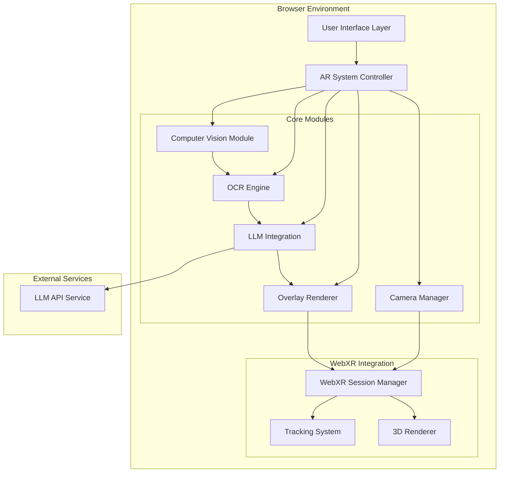

# Design Document: LENS-EXEC AR Code Analysis System

## Overview

LENS-EXEC is a web-based augmented reality application that combines computer vision, optical character recognition (OCR), and multimodal large language models to provide real-time code analysis and feedback. The system captures live camera feeds, detects and extracts code from physical surfaces, analyzes it using AI, and overlays visual feedback directly onto the user's view through WebXR technology.

The application runs entirely in the browser, leveraging modern web APIs for camera access, WebXR for AR capabilities, client-side OCR for text extraction, and cloud-based LLM APIs for intelligent code analysis.

## Architecture

The system follows a modular architecture with clear separation of concerns:



## Components and Interfaces

### 1. Camera Manager
**Responsibility**: Manages device camera access and video stream processing.

**Key Methods**:
- `requestCameraPermission()`: Requests user permission for camera access
- `initializeCameraFeed()`: Sets up video stream from device camera
- `getCameraFrame()`: Returns current camera frame for processing
- `handleCameraError(error)`: Manages camera-related errors

**Dependencies**: WebRTC getUserMedia API, WebXR Device API

### 2. Computer Vision Module
**Responsibility**: Processes camera frames to detect regions containing code.

**Key Methods**:
- `detectCodeRegions(frame)`: Identifies rectangular regions likely containing code
- `preprocessImage(region)`: Enhances image quality for OCR processing
- `calculateConfidence(region)`: Estimates detection confidence level
- `trackRegionMovement(region, previousFrame)`: Tracks code regions across frames

**Technology**: OpenCV.js for image processing, custom algorithms for code pattern detection

### 3. OCR Engine
**Responsibility**: Extracts text content from detected code regions.

**Key Methods**:
- `extractText(imageRegion)`: Converts image region to text using OCR
- `validateCodeSyntax(text)`: Basic syntax validation to confirm code content
- `getExtractionConfidence()`: Returns confidence level of text extraction
- `preprocessForOCR(image)`: Optimizes image for better OCR accuracy

**Technology**: Tesseract.js for client-side OCR processing

### 4. LLM Integration Module
**Responsibility**: Interfaces with multimodal language models for code analysis.

**Key Methods**:
- `analyzeCode(codeText, imageContext)`: Sends code and image to LLM for analysis
- `parseAnalysisResponse(response)`: Structures LLM response into actionable feedback
- `handleAPIErrors(error)`: Manages API failures and rate limiting
- `queueAnalysisRequest(request)`: Manages request queuing for performance

**API Integration**: OpenAI GPT-4V, Anthropic Claude 3.5 Sonnet, or Google Gemini 1.5 Pro

### 5. WebXR Session Manager
**Responsibility**: Manages AR session lifecycle and coordinate systems.

**Key Methods**:
- `initializeARSession()`: Sets up WebXR immersive AR session
- `getViewerPose()`: Returns current camera pose in world coordinates
- `transformToWorldSpace(screenCoords)`: Converts screen coordinates to world space
- `handleSessionEnd()`: Cleans up AR session resources

**Technology**: WebXR Device API, WebXR AR Module

### 6. Overlay Renderer
**Responsibility**: Renders visual feedback overlays in AR space.

**Key Methods**:
- `createErrorOverlay(position, errorInfo)`: Creates error indicator at specified position
- `createSuggestionOverlay(position, suggestion)`: Renders improvement suggestions
- `updateOverlayPosition(overlay, newPosition)`: Updates overlay position for tracking
- `removeOverlay(overlayId)`: Removes specific overlay from scene

**Technology**: Three.js for 3D rendering, WebGL for performance

## Data Models

### CodeRegion
```typescript
interface CodeRegion {
  id: string;
  boundingBox: Rectangle;
  confidence: number;
  extractedText: string;
  detectionTimestamp: number;
  trackingHistory: Position[];
}
```

### AnalysisResult
```typescript
interface AnalysisResult {
  codeRegionId: string;
  language: string;
  errors: CodeIssue[];
  suggestions: CodeSuggestion[];
  simulationResult?: ExecutionResult;
  analysisTimestamp: number;
}
```

### CodeIssue
```typescript
interface CodeIssue {
  type: 'syntax' | 'logic' | 'style' | 'security';
  severity: 'low' | 'medium' | 'high';
  lineNumber?: number;
  description: string;
  suggestedFix?: string;
}
```

### AROverlay
```typescript
interface AROverlay {
  id: string;
  type: 'error' | 'suggestion' | 'simulation';
  position: Vector3;
  content: OverlayContent;
  visibility: boolean;
  trackingTarget: CodeRegion;
}
```

Now I need to use the prework tool to analyze the acceptance criteria before writing the correctness properties.

## Correctness Properties

*A property is a characteristic or behavior that should hold true across all valid executions of a system—essentially, a formal statement about what the system should do. Properties serve as the bridge between human-readable specifications and machine-verifiable correctness guarantees.*

### Property 1: Camera Permission Handling
*For any* camera permission response (granted or denied), the AR_System should display the appropriate UI state (camera feed for granted, error message for denied)
**Validates: Requirements 1.2, 1.3**

### Property 2: HTTPS Protocol Enforcement
*For any* camera access attempt over HTTP protocol, the AR_System should fail and prevent camera access
**Validates: Requirements 1.4**

### Property 3: Code Region Detection and Processing
*For any* camera frame containing visible code, the Code_Scanner should detect code regions and extract text content from each region independently
**Validates: Requirements 2.1, 2.2, 2.3**

### Property 4: Detection Confidence Reporting
*For any* code detection attempt, the Code_Scanner should provide confidence levels indicating the quality of detection
**Validates: Requirements 2.4**

### Property 5: Programming Language Support
*For any* common programming language code sample, the Code_Scanner should successfully detect and process the code
**Validates: Requirements 2.5**

### Property 6: LLM Analysis Request Completeness
*For any* extracted code text, the LLM_Analyzer should request language identification, error detection, and improvement suggestions from the multimodal language model
**Validates: Requirements 3.1, 3.2, 3.3, 3.4**

### Property 7: Structured Analysis Results
*For any* completed LLM analysis, the LLM_Analyzer should return properly structured Analysis_Results containing all required fields
**Validates: Requirements 3.5**

### Property 8: LLM Service Error Handling
*For any* LLM service failure or unavailability, the LLM_Analyzer should provide appropriate error handling and user feedback
**Validates: Requirements 3.6**

### Property 9: Overlay Creation for Analysis Results
*For any* received Analysis_Results containing errors, suggestions, or other feedback, the Overlay_Renderer should create appropriate visual indicators over the corresponding code regions
**Validates: Requirements 4.1, 4.2, 4.3**

### Property 10: Visual Style Differentiation
*For any* overlay containing multiple types of feedback (errors, warnings, suggestions), the Overlay_Renderer should use distinct visual styles for each feedback type
**Validates: Requirements 4.6**

### Property 11: Code Simulation Execution
*For any* executable code when simulation is enabled, the AR_System should provide simulated execution results and display them in designated overlay areas
**Validates: Requirements 5.1, 5.2**

### Property 12: Security Risk Prevention
*For any* code containing potential security risks when simulation is enabled, the AR_System should prevent execution and display appropriate warnings
**Validates: Requirements 5.3**

### Property 13: Simulation Language Support
*For any* common programming language when simulation is enabled, the AR_System should support basic simulation capabilities
**Validates: Requirements 5.4**

### Property 14: Simulation Failure Handling
*For any* simulation failure when simulation is enabled, the AR_System should display error messages explaining the failure
**Validates: Requirements 5.5**

### Property 15: Scanning Status Indication
*For any* active scanning session, the AR_System should display visual indicators showing the current scanning status
**Validates: Requirements 6.2**

### Property 16: Analysis Progress Indication
*For any* analysis operation in progress, the AR_System should display loading indicators to inform the user
**Validates: Requirements 6.4**

### Property 17: Request Timeout Handling
*For any* LLM analysis request, the LLM_Analyzer should implement appropriate timeout handling to prevent indefinite waiting
**Validates: Requirements 7.2**

### Property 18: Request Queue Management
*For any* multiple pending analysis requests, the AR_System should manage request queuing to prevent system overload
**Validates: Requirements 7.5**

### Property 19: System Error Resilience
*For any* component failure or error condition, the AR_System should provide clear error messages, maintain core functionality, and log errors for debugging
**Validates: Requirements 8.1, 8.2, 8.3, 8.4, 8.5**

### Property 20: Network Connectivity Recovery
*For any* network connectivity loss and restoration, the LLM_Analyzer should queue requests during outages and retry them when connection is restored
**Validates: Requirements 8.2**

## Error Handling

The system implements comprehensive error handling across all components:

### Camera Access Errors
- **Permission Denied**: Display user-friendly message with instructions to enable camera access
- **Hardware Unavailable**: Provide fallback options or alternative input methods
- **HTTPS Required**: Clear messaging about security requirements

### Computer Vision Errors
- **Detection Failures**: Continue operation without crashing, provide confidence indicators
- **OCR Errors**: Graceful degradation with partial text extraction
- **Image Quality Issues**: Provide feedback to user about optimal positioning

### LLM Integration Errors
- **API Failures**: Queue requests for retry, display user-friendly error messages
- **Rate Limiting**: Implement backoff strategies and user notification
- **Network Issues**: Offline queuing with automatic retry on reconnection
- **Malformed Responses**: Robust parsing with fallback to basic analysis

### AR Rendering Errors
- **WebXR Unavailable**: Fallback to 2D overlay mode
- **Tracking Loss**: Maintain overlay positions using last known coordinates
- **Performance Issues**: Dynamic quality adjustment to maintain frame rate

## Testing Strategy

The testing approach combines unit testing for specific functionality with property-based testing for universal behaviors:

### Unit Testing
- **Component Integration**: Test interactions between Camera Manager, CV Module, and OCR Engine
- **API Integration**: Mock LLM service responses to test analysis result processing
- **Error Conditions**: Simulate various failure scenarios (camera unavailable, network errors, malformed API responses)
- **UI Interactions**: Test user interface controls and feedback mechanisms

### Property-Based Testing
- **Universal Properties**: Validate that correctness properties hold across all valid inputs
- **Input Generation**: Generate diverse code samples, camera frames, and analysis results
- **Edge Case Discovery**: Use property testing to discover unexpected edge cases
- **Performance Validation**: Test system behavior under various load conditions

**Testing Framework**: Jest for unit testing, fast-check for property-based testing in JavaScript/TypeScript

**Property Test Configuration**:
- Minimum 100 iterations per property test
- Each test tagged with format: **Feature: lens-exec, Property {number}: {property_text}**
- Comprehensive input generators for code samples, camera frames, and API responses
- Performance benchmarks for real-time processing requirements

### Integration Testing
- **End-to-End Workflows**: Test complete code scanning and analysis workflows
- **WebXR Integration**: Validate AR session management and overlay rendering
- **Cross-Browser Compatibility**: Test on major browsers supporting WebXR
- **Device Testing**: Validate on various mobile and desktop devices with cameras

### Performance Testing
- **Real-Time Processing**: Validate frame rate maintenance during active scanning
- **Memory Usage**: Monitor memory consumption during extended sessions
- **Network Efficiency**: Test API request optimization and caching strategies
- **Battery Impact**: Assess power consumption on mobile devices